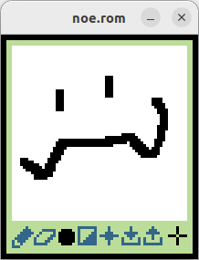

an app for tiny drawings



you need [Uxn](https://100r.co/site/uxn.html) to run this.
```sh
uxnemu noe.rom image.icn
```
if the image is not specified, a [snarf](https://wiki.xxiivv.com/site/snarf.html) file is created an used.

## controls

- digits to select a tool
- ^n to clear the canvas
- ^o to open the file
- ^s to save the file
- ^q to quit

